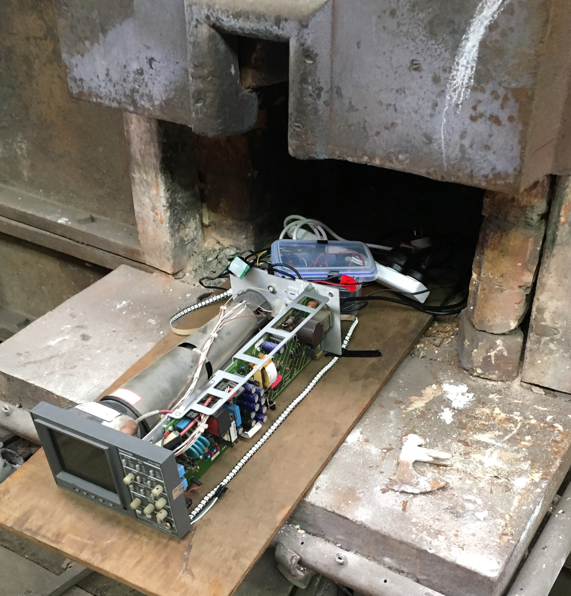
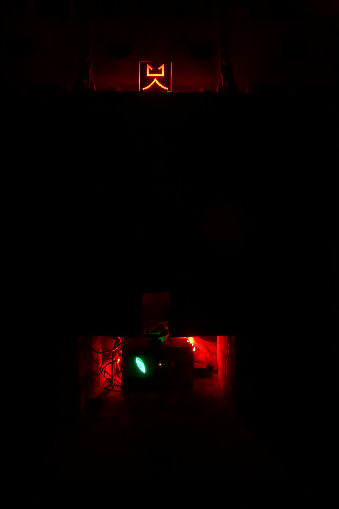

# contrascientia & antepyrosis

this intearctive, digital scuplture was designed and created by elektra jiang, this code allows these installs to run reliably without a computer

this code powered two installations at caldera.sydney, called contrascientia and antepyrosis.

they were both placed in abandoned blacksmith furnaces within the eveleigh train works building in syndey.

